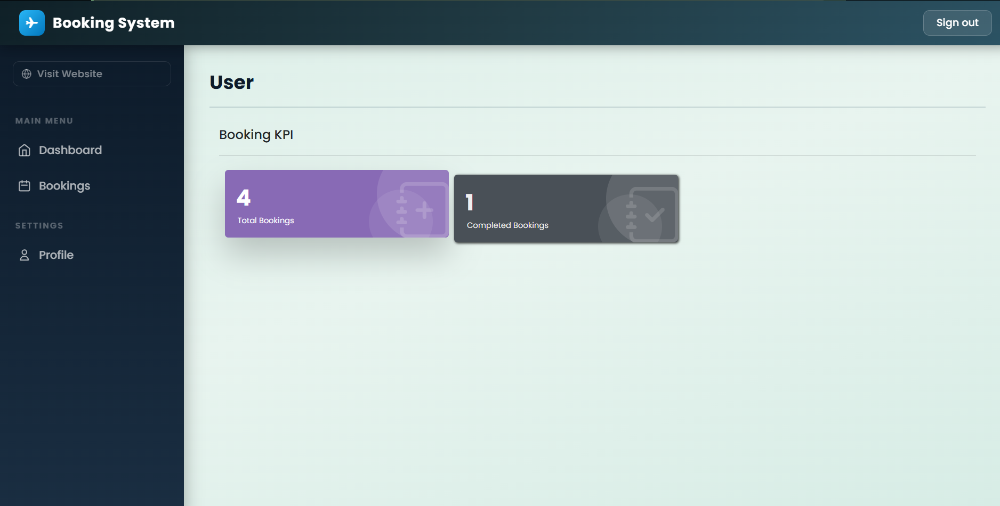

# Booking Management System (Laravel)

## Overview
A web-based booking management system built using Laravel. It allows users to manage bookings and reservations efficiently with database integration.

## Features
- Create and manage bookings  
- Update and delete records  
- Database integration using MySQL  
- Structured backend using MVC  

## Tech Stack
- PHP (Laravel)  
- MySQL  
- HTML, CSS, JavaScript  
- Bootstrap  

## Screenshot


## Setup Instructions

1. Clone the repository  

2. Install dependencies:
```
composer install
```

3. Create environment file:
```
copy .env.example .env
```

4. Generate app key:
```
php artisan key:generate
```

5. Import database (if applicable)

6. Run server:
```
php artisan serve
```

7. Open:
```
http://127.0.0.1:8000
```

## Notes
- vendor and node_modules are excluded  
- Requires PHP, Composer, and MySQL  

## Author
Procheta Ray
